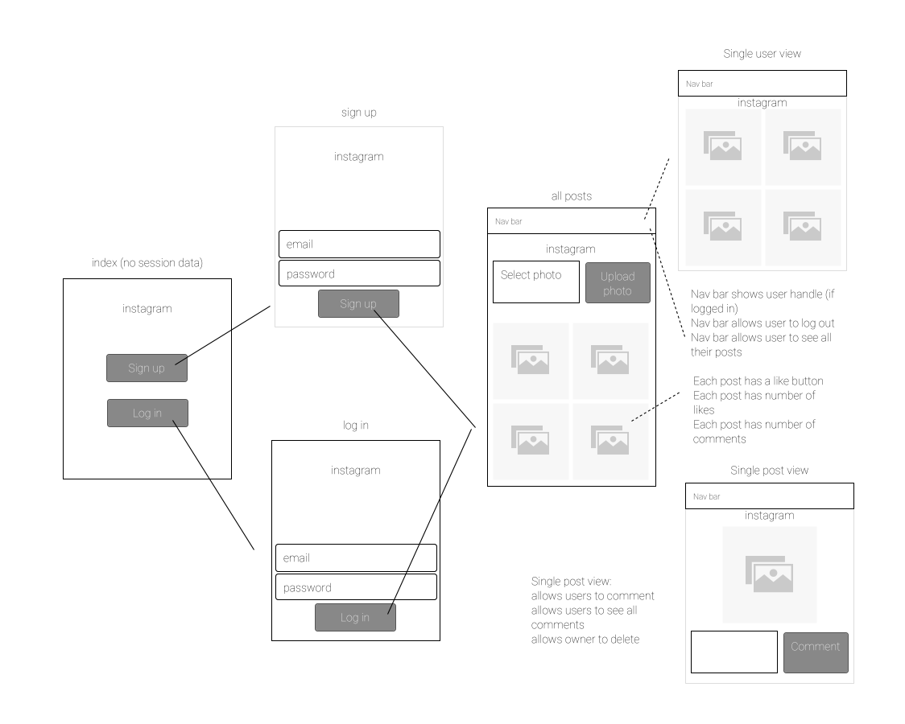

# Instagram Challenge

[](https://travis-ci.org/DaveLawes/instagram-challenge)

This is an Instagram clone built using Ruby on Rails. Users can sign up/log in and then see all the photos that have been posted on the site. Users can like/unlike photos, as well as seeing their own gallery of photos.

Technologies: Rails, ActiveRecord, Devise, Active Storage, RSpec


## Planning

### User Stories

The following user stories were created at the beginning of the project to define my intentions (and aspirations) for the application.

```
As a user
So I can share my photos
I'd like to sign up to Instagram

As a user
So I can share my photos
I'd like to save my photos on Instagram

As a user
So I can see other peoples' photos
I'd like to see all photos on Instagram

As a user
So no one else can share photos on my account
I'd like to be able to log out of Instagram

As a returning user
So I can see the photos I've shared
I'd like to log in and see only my photos

As a user
So I can share enthusiasm for other photos
I'd like to be able to like a photo

As a user
So I can change my mind
I'd like to be able to unlike a photo

As a user
So I can react to a photo
I'd like to be able to comment on a photo

```

### User Flow

The following diagram documents my intention for how the user will navigate through the application. It helped to understand what views and associated redirections were required.




### Models

Models were defined to document what information was required by each class, and the relationships between the classes. The models were subsequently built using Active Record.

| User | Post |
|-----| -----|
| has unique email | has user_id
| has password | has title text
| has many posts | has image attached
| has many likes (only 1 like per post) | has many likes
| has many comments | has many comments


| Likes | Comments
|----| -----|
| has user_id | has user_id
| has post_id | has post_id
| | has text

### Task Breakdown

Take a look at my card wall to understand how I broke down all the jobs, and an idea of how I prioritised them too:

https://waffle.io/DaveLawes/instagram-challenge


## How to Use

### Technical Overview

- Database: ActiveRecord with an SQLite3 database was used for this project. The database is hosted locally on your machine for both testing and development purposes. ActiveRecord was used to create the models for Users, Posts and Likes. The schema was updated throughout the project by use of migration files. 
- Images were handled using Active Storage: each post was defined as having one attached image, with the image being saved in a separate (pre-defined) table in blob format. This allowed the Post model to contain other data, such as id, title, when it was created, etc. 
- Authentication: the User model was created using the Devise gem. As well as creating the model it also generated routes and views to manage user registration, authentication and sessions. Awesome!
- Controllers: where controllers were not pre-defined, these were created to control the behaviour based on certain routes (url paths). 
- Views: structured using embedded Ruby and styled using CSS, the views enhance the user experience.

### Installation

Fork this repo and then do the following:

* Ensure your Ruby version is 2.5.1.

* Install `Rails` on your local machine if you don't have it already.

* Run `bundle install` to make sure all system dependencies have been installed.

* To configure the database run the following commands from within the project repo:
	1. `rails db:create` --> this will create the databases you need for test, development and production.
	2. `rails db:migrate` --> this will run the database migration files so your local tables have the correct structure.

* Start the rails server: `rails server` then visit `localhost:3000` to see the webpage!


### Testing

Test coverage for the application was assessed using SimpleCov: currently the app has 100% test coverage.

To run the suite of tests run `rspec`. Tests were broken down in the following way:

- Feature tests were written the follow on from the user stories. The feature tests apply a series of actions and validate a number of results. The closely follow the user flow through the application.
- Model tests were written to help validate the expected behaviours and relationships of the models created. Model tests assert relationships between models.
- Controller tests were written to define what http requests were being made (on what routes), what the expected responses were, and also any redirections. 


### Use

This gif shows the basic user flow through the app:

<p align="center">

</p>


## Areas of Improvement

Some areas for improvement are:

- Adding comments to each photo and enabling the user to delete photos once they've been uploaded (I ran out of time).
- Improving transitions between each request/response cycle: instead of refreshing the page on a user action it would be more visually appealing to use a front-end server to manage on-browser changes (then communicate to the back-end server via an API).
- Enhancing the way I handle images: currently I can only accept square photos (they aren't cropped by the application). Also I can't apply filters to photos once they're uploaded.


